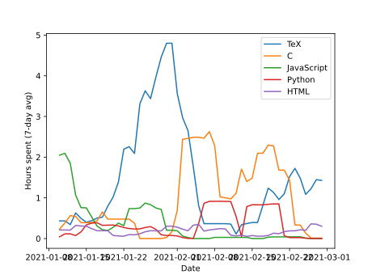

# Wakatime Visualizer
Visualize your language and editor data from [wakatime](https://wakatime.com/).





## Usage
```sh
./wakatime_visualize.sh <input(json)>
```
Where the `.json` file is the file you download from your wakatime account, in Settings > Export.

## Installation
```sh
pip install -r requirements.txt
chmod +x wakatime_visualize.sh
```
Any version of Python 3.x will work.

### Wakadump
**Warning!**

[Wakadump](https://github.com/wakatime/wakadump) has outdated dependencies, and if you are using Python 3.9+, it may break your dependencies.
